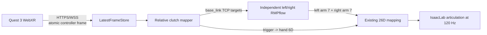

# Meta Quest 3 双臂摇操

本项目提供独立的 `teleoperation/` 子系统，通过 Quest Browser 的 WebXR 手柄输入控制
IsaacLab 中的 S4 双臂和双灵巧手。该功能不传输视频，也不修改采集、转换、训练或
rollout 的既有实现。

## 控制链路



输入包包含同一 WebXR 帧中的左右手柄位姿、`trigger`、`squeeze`、按键、序号、
客户端时间戳和 tracking validity。服务端只保留最新完整帧，不排队执行旧动作。

控制定义：

- 左右 `Grip/Squeeze`：对应手臂的独立 clutch。
- 左右 `Trigger`：对应灵巧手连续开合，范围 `0..1`。
- 松开 `Grip`：冻结该侧 TCP 目标，手柄可回到舒适位置后重新 clutch。
- tracking 超过 `1.0 s` 未更新：解除双侧 clutch 并冻结双臂；恢复后必须先松开再重新按 Grip。
- `Ctrl+C`：结束摇操并关闭 Isaac Sim。

## 环境要求

- PC 和 Quest 3 位于同一局域网，彼此可访问。
- `env_isaaclab` 中安装 `aiohttp==3.11.11`。
- 系统提供 `openssl`。
- Quest Browser 允许 WebXR，页面必须通过可信的 HTTPS 上下文打开。
- 防火墙允许配置端口，默认 `8443/tcp`。

摇操不需要 `smolvla` 环境，不启动 LeRobot 或策略服务器。

## 第一次使用

### 1. 确认 PC 局域网地址

```bash
hostname -I
```

例如 PC 地址是 `192.168.1.116`。

### 2. 生成 HTTPS 证书

```bash
cd /path/to/s4_smolvla_isaaclab
bash run.sh teleop-cert --ip 192.168.1.116
```

输出写入被 Git 忽略的：

```text
.local/teleoperation/cert.pem
.local/teleoperation/key.pem
```

不要提交或分享 `key.pem`。IP 变化后应使用新 IP 和 `--overwrite` 重新生成。

自签名证书是否被视为可信安全上下文取决于 Quest Browser 版本。先在 Quest Browser
打开 URL 并接受证书警告；如果页面仍显示 `WebXR is unavailable`，需要为 PC 配置受信任
的局域网证书或有效 DNS 证书，而不是退回 HTTP。`--insecure-http` 只用于桌面协议测试。

### 3. 启动 IsaacLab 摇操

```bash
bash run.sh activate-task drawer_insert_close
bash run.sh teleop
```

默认使用 `RMPflow`。需要与旧控制效果对照时可仅对当前进程回退，不修改 YAML：

```bash
bash run.sh teleop --controller-backend pinocchio
```

终端会打印实际访问地址，例如：

```text
[TELEOP] Quest URL: https://192.168.1.116:8443
```

### 4. 在 Quest 3 中连接

1. 用 Quest Browser 打开终端显示的 HTTPS URL。
2. 首次连接时接受证书提示。
3. 点击 `Enter VR Teleoperation`。
4. 保持两个手柄 tracking 正常。
5. 按住某一侧 Grip 后缓慢移动手柄，该侧机器人 TCP 才会跟随。Grip 必须持续按住，
   Trigger 只控制手指，不会启用手臂跟随。

页面优先请求 Quest Browser 的 `immersive-ar` 模式，以透明 passthrough 方式显示真实环境；
如果浏览器不支持则退回 `immersive-vr`。本项目不向头显传输 Isaac Sim 图像。
6. 缓慢按下 Trigger，检查对应灵巧手从张开连续过渡到闭合。

首次测试不要让机器人靠近抽屉、罐子或自身身体。先分别测试单臂小范围平移，再测试旋转，
最后测试双臂。

## 坐标约定

WebXR `local-floor`：

```text
+X: 操作者右侧
+Y: 上方
-Z: 操作者前方
```

S4 `base_link`：

```text
+X: 机器人前方
+Y: 机器人左侧
+Z: 上方
```

默认基变换位于
[`configs/teleoperation/meta_quest3.yaml`](../configs/teleoperation/meta_quest3.yaml)：

```yaml
controller_to_base_rotation:
  - [0.0, 0.0, -1.0]
  - [-1.0, 0.0, 0.0]
  - [0.0, 1.0, 0.0]
```

摇操采用相对 clutch，因此不把 Quest 世界原点直接当作机器人原点，也不使用 HMD 头部
姿态。按下 Grip 时保存当前手柄位姿和当前 TCP；后续只映射二者的相对变化。

## 灵巧手映射

摇操从 active task 的 `scripted.yaml` 读取已经验证的 `left_open`、`left_close`、
`right_open` 和 `right_close`，执行：

```text
hand6 = open6 + trigger * (close6 - open6)
```

随后复用 `s4_robot/control_mapping.py` 展开 active/mimic joints。没有使用 BenchHub 中
`_grip_max=2.0` 的硬编码映射。

## RMPflow 控制后端

RMPflow 只替换遥操作内部的 TCP 到 14D 手臂关节目标计算：

```text
Quest -> relative TCP target -> RMPflow LA7+RA7 -> existing 26D mapping
      -> active/mimic hand expansion -> articulation position target
```

采集、HDF5、LeRobot 转换、训练、policy server 和 rollout 不导入
`teleoperation/controllers/`，因此本次切换不会改变旧数据或 checkpoint 的接口。详细设计、
碰撞边界和调参说明见 [TELEOPERATION_RMPFLOW.md](TELEOPERATION_RMPFLOW.md)。

实现采用两个独立的单臂 policy：

- 左侧 c-space 只有 `left_arm_7`，右侧只有 `right_arm_7`。
- 每侧使用简化的 5 组 collision spheres，并对一个简化 torso cylinder 做避碰。
- 不计算左右臂互相碰撞。
- 当前不向 RMPflow world 注册桌子、抽屉和罐子，因此不提供环境避碰保证。
- 目标仍是项目既有虚拟 TCP。后端会在内部减去旋转后的
  `DEFAULT_TCP_OFFSET_WRIST=[0,0,-0.10]`，再把 wrist frame 目标交给 Lula。

## 平滑和安全参数

唯一摇操配置入口：

```text
configs/teleoperation/meta_quest3.yaml
```

常用参数：

| 参数 | 含义 | 默认值 |
|---|---|---:|
| `stale_timeout_s` | 输入超时后冻结 | `1.0 s` |
| `engage/release_threshold` | clutch 滞回阈值 | `0.30/0.12` |
| `trigger_time_constant_s` | 扳机低通时间常数 | `0.05` |
| `position_scale` | 手柄相对位移到 TCP 位移的比例 | `2.2` |
| `max_translation_speed_m_s` | TCP 目标最大平移速度 | `1.60` |
| `max_rotation_speed_rad_s` | TCP 目标最大旋转速度 | `5.50` |
| `arm_max_joint_step_rad` | 每个仿真步最大手臂关节命令变化 | `0.065` |
| `hand_max_joint_step_rad` | 最终手部命令每步上限 | `0.012` |
| `controller.backend` | 遥操作手臂求解器 | `rmpflow` |
| `evaluations_per_frame` | RMPflow 每物理步积分子步 | `2` |
| `update_every_n_steps` | 每侧 RMPflow 每几个物理步求解一次 | `2` |
| `render_every_n_steps` | 遥操作 GUI 每几个物理步渲染一次 | `2` |
| `ik.*` | Pinocchio 回退后端参数 | 见 YAML |

RMPflow 下的平滑顺序是：TCP 目标空间限速、RMP policy、最终 26D 分组限幅。不要先调低
stiffness/damping 来掩盖坐标跳变、网络 stale 或 RMP 参数问题。

workspace clamp 不是碰撞检测。当前简化模型只提供有限的单臂对 torso 约束；操作时仍需
在接近另一只手臂、抽屉或桌面前松开 Grip。

## 诊断

运行时日志示例：

```text
[TELEOP] clients=1 frame_age=12ms stale=False clutch(L/R)=1/0 \
trigger(L/R)=0.35/0.00 target_L=(+0.420,+0.220,+0.180) ...
```

判断顺序：

1. `clients=1`：Quest 已建立 WSS。
2. `frame_age < 100ms`：数据持续刷新。
3. `stale=False`：安全门允许 clutch。
4. 持续按住 Grip 后相应 `grip_input` 应接近 `1.00`，且 `clutch=1`。
5. 移动手柄时相应 `target_L/R` 平滑变化。
6. Trigger 改变时 `trigger_raw` 和 `trigger_cmd` 应随之变化。
7. `track_arm`、`track_hand` 是目标关节与实际关节的最大误差；输入变化但实际机器人不动时，
   这两个值会帮助判断问题是否位于底层跟踪。
8. `loop` 是实际控制循环频率，`rtf` 是仿真实时因子。`rtf=1.0` 表示 120 Hz 实时运行；
   `rtf<1.0` 表示渲染使仿真慢于墙钟时间。WebXR 目标限速使用墙钟时间，避免该情况额外拖慢手感。

## Passthrough 与摘下头显

Quest passthrough 是头显摄像头对真实显示器的再拍摄，文字和 Isaac Sim 细节通常不如裸眼清晰。
本项目没有向头显传输桌面或仿真视频，因此不能通过网页提高真实显示器在 passthrough 中的清晰度。

网页优先请求 Guardian 固定的 `bounded-floor`，不可用时才退回 `local-floor` 或 `local`。正常
戴着头显走动或转头不会把 viewer pose 叠加到手柄控制方向中。

但摘下 Quest 后，接近传感器和系统电源管理可能暂停 immersive WebXR，控制器 6DoF 数据会
停止，Guardian 恢复时还可能触发 reference-space reset。网页无法可靠绕过这一系统行为。
现在 visibility hidden、tracking 丢失或 reference-space reset 都会主动发送 invalid frame，冻结
双臂并进入 `requires_release`。恢复后必须：

1. 重新进入 XR（若会话已经结束）。
2. 两侧 Grip 完全松开。
3. 将手柄放到舒适起始位置。
4. 重新按住 Grip，建立新的相对位姿参考。

不要在 Grip 持续按住时移动或重新佩戴头显。要实现长期摘下头显仍持续获得稳定 6DoF，必须
换用不依赖 Quest Browser immersive session 生命周期的原生 tracking 传输方案；当前 WebXR
链路不能保证这一点。

Quest 固件或 WebXR profile 的按钮排列不明确时，使用：

```bash
bash run.sh teleop --input-debug --report-period-s 1.0
```

`[TELEOP][RAW]` 会显示每侧完整的 `buttons=[...]`、`axes=[...]`、profile 和手柄位姿。
持续按住侧握 Grip，观察哪个 `buttons[N]` 从 `0.00` 变为 `1.00`，然后只修改
`configs/teleoperation/meta_quest3.yaml`：

```yaml
mapping:
  clutch:
    button_indices: [1]  # N; validated Quest 3 meta-quest-touch-plus Grip
```

不要把 Trigger 对应的索引 `0` 配成 clutch，否则抓手闭合时会同时移动手臂。

桌面页面或协议测试可以使用：

```bash
bash run.sh teleop --insecure-http --port 18443
```

这不能在 Quest 中启动 immersive WebXR。

完整控制链 smoke test：

```bash
bash run.sh teleop \
  --insecure-http \
  --headless \
  --synthetic-input \
  --max-runtime-s 2 \
  --port 18443
```

成功标志：

```text
[TELEOP][SMOKE] synthetic arm command max_delta=...rad
```

## 与已有数据链路的边界

摇操最终生成的命令严格保持现有 26D absolute joint target 顺序：

```text
left_arm_7 + left_hand_6 + right_arm_7 + right_hand_6
```

当前入口首先用于验证人工控制，不自动写 HDF5，也不改变 `record` 命令。后续接入人工示教
采集时，应在现有 writer 边界按 20 Hz 采样：三路 RGB、实际 26D state 和本入口最终的
commanded 26D action；不能记录 WebXR TCP pose 来替代训练 action。

## 文件边界

```text
teleoperation/
├── certificate.py          # 本地 HTTPS 证书
├── config.py               # typed YAML 配置
├── protocol.py             # 原子帧协议和 latest-frame store
├── server.py               # HTTPS/WSS 服务
├── mapping.py              # clutch、坐标变换、限速、trigger 映射
├── isaaclab_teleop.py      # 独立 IsaacLab runtime
└── webxr/index.html        # Quest Browser 页面
```

公共 `s4_robot/` 只被调用，没有为摇操修改。`scripts/record_dataset.py`、转换、训练、
policy server 和 rollout 均保持原入口。
