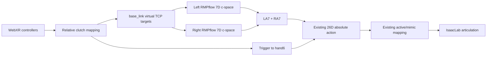

# RMPflow 双臂遥操作后端

本文说明 Quest 3 遥操作中的 RMPflow 实现、配置和验证边界。它不是采集或 rollout
控制器的替代品，只服务于 `bash run.sh teleop`。

## 设计边界



左右 policy 独立运行。这样实现简单、响应连续，也满足当前“不考虑双臂碰撞”的需求；代价是
两只手臂可能互相穿越，操作者必须主动避免。

以下模块保持不变：

- `scripts/record_dataset.py`
- `data/` 下 HDF5 和 LeRobot 转换
- `scripts/train_smolvla_local.sh`
- `scripts/policy_server.py`
- `scripts/eval_policy.py`
- 既有 26D schema、dataset 和 checkpoint

## 文件职责

| 文件 | 职责 |
|---|---|
| `teleoperation/controllers/__init__.py` | 按配置创建后端 |
| `teleoperation/controllers/rmpflow_backend.py` | 双单臂 policy、坐标变换、14D 输出 |
| `teleoperation/controllers/pinocchio_backend.py` | 旧 DLS 后端兼容包装 |
| `configs/teleoperation/meta_quest3.yaml` | 后端选择和路径 source of truth |
| `configs/teleoperation/rmpflow/s4_*_descriptor.yaml` | 每侧 7D c-space 和简化 collision spheres |
| `configs/teleoperation/rmpflow/s4_*_rmpflow.yaml` | RMP gains、速度、关节限位和 torso cylinder |

## 坐标和 TCP 换算

WebXR 相对位姿先由 `teleoperation/mapping.py` 转成 `base_link` 下的虚拟 TCP 目标。当前项目
TCP 相对 `*_wrist_yaw_link` 的平移是：

```text
p_wrist_tcp = [0, 0, -0.10] m
```

Lula descriptor 的末端 frame 是实际 URDF frame `left_wrist_yaw_link` 或
`right_wrist_yaw_link`。后端执行：

```text
R_base_wrist = R_base_tcp
p_base_wrist = p_base_tcp - R_base_tcp * p_wrist_tcp
T_world_wrist = T_world_base * T_base_wrist
```

然后以 `wxyz` quaternion 将 world wrist pose 交给 RMPflow。不要把 descriptor 的
`frame_name` 直接换成手部 visual prim；它必须是 URDF 中的真实 link。

## 简化碰撞模型

每侧 descriptor 只在 shoulder、elbow 和 wrist 上设置少量球体。policy 文件把 elbow/wrist
作为 body collision controller，并设置一个 `base_link` 坐标下的 torso cylinder。

当前保证范围：

- RMPflow 有单臂简化几何描述。
- 单臂末端和前臂会受到 torso cylinder 的排斥策略影响。

当前不保证：

- 左右臂互相避碰。
- 手指精细碰撞。
- 桌子、抽屉、罐子或背景场景避碰。
- 以 collision mesh 精确贴合机器人外形。

`collision_spheres` 只有在向 RMPflow world 注册外部 obstacle 后才参与环境避碰。本实现没有
注册外部物体，避免把任务场景逻辑耦合进通用遥操作模块。

## 使用和回退

默认启动：

```bash
bash run.sh teleop
```

明确指定 RMPflow：

```bash
bash run.sh teleop --controller-backend rmpflow --input-debug
```

对照旧 Pinocchio DLS：

```bash
bash run.sh teleop --controller-backend pinocchio --input-debug
```

启动成功必须看到：

```text
[TELEOP][RMPFLOW] ready: independent left/right policies ...
[TELEOP][CTRL] backend=rmpflow ...
```

## 调参顺序

控制不跟手时按以下顺序检查，避免同时修改多层参数：

1. `frame_age`、`stale`、`clutch` 和 `target_L/R`，确认 WebXR 与映射有效。
2. `loop` 和 `rtf`。渲染循环远低于 `120 Hz` 时，墙钟响应会受仿真吞吐限制。
3. `tcp_pos_err`、`tcp_rot_err` 和 `solver_q_step`，确认 RMPflow 在产生关节变化。
4. `track_arm`，确认 articulation 能跟随 26D command。
5. 再调目标空间 `position_scale` 和速度上限。
6. 最后调整 RMPflow gains 或最终 `arm_max_joint_step_rad`。

遥操作默认每两个物理步渲染一次：物理和关节控制仍是 `120 Hz`，桌面 GUI 的目标上限约为
`60 Hz`。该设置只在 `configs/teleoperation/meta_quest3.yaml` 生效，不会改变数据采集、视频
FPS 或 rollout。若机器仍无法接近实时，优先将 `render_every_n_steps` 调到 `3`，并观察
`rtf`，不要修改项目的 20/120 Hz 数据契约。

左右 RMPflow 默认各以 `60 Hz` 求解，并交错到相邻的 120 Hz 物理步；未求解的中间步保持
最近的 7D 目标。这样每个物理步通常只运行一个 Lula policy，降低双 policy 串行计算造成的
延迟。`update_every_n_steps=1` 会让两侧都以 120 Hz 求解，但 CPU 负载和墙钟延迟明显增加。

RMPflow 的 action integration 使用实际墙钟控制间隔，而不是固定 `1/120 s`。这是因为 GUI
场景下实际循环可能只有 `40-60 Hz`；继续使用固定 physics dt 会使末端在墙钟时间下慢 2 到
3 倍。单次 policy dt 被限制为 `50 ms`，避免一次渲染或网络卡顿造成关节目标突跳。此行为只
影响交互遥操作，不改变仿真 physics dt，也不影响采集和 rollout。

常用 RMP 参数：

| 参数 | 增大后的主要影响 | 风险 |
|---|---|---|
| `target_rmp.accel_p_gain` | 更快追踪位置 | 超调、接触冲击 |
| `target_rmp.accel_d_gain` | 增加平移阻尼 | 过大时显得迟缓 |
| `axis_target_rmp.accel_p_gain` | 更快追踪姿态 | 手腕快速旋转 |
| `joint_velocity_cap_rmp.max_velocity` | 放宽关节速度 | 动作过快 |
| `damping_rmp.accel_d_gain` | 增加整体稳定性 | 过大时不跟手 |
| `evaluations_per_frame` | 提高积分稳定性 | 增加 CPU 开销，不直接提高速度 |

一次只改一类参数，并先在无接触的小范围单臂动作中验证。`joint_stiffness/damping` 不是修复
目标映射或 RMP 参数的第一手段。

当前默认是偏快速的交互配置：`position_scale=2.2`、平移限速 `1.6 m/s`、旋转限速
`5.5 rad/s`、最终关节单步上限 `0.065 rad`。第一次验证应远离机器人身体和场景物体；若出现
超调，优先降低 `position_scale` 和两个 Cartesian 速度上限，而不是修改 articulation gains。

## 验证

不连接 Quest 的短时 GPU smoke：

```bash
TERM=xterm bash run.sh teleop \
  --headless \
  --insecure-http \
  --synthetic-input \
  --max-runtime-s 5 \
  --port 18443
```

成功标志是：

- 两侧 RMPflow 均打印 `ready`。
- `solver_q_step` 非零。
- 退出前打印 `[TELEOP][SMOKE] arm_command_max_delta=... measured_tcp_rotation=...`。
- 没有 `cspace mismatch`、NaN 或 26D shape 错误。

Lula 可能提示 hand mimic chain 终止于非 c-space joint。手部不在 RMPflow c-space 中，且仍由
现有 6D hand mapping 下发，因此该提示不是手臂控制失败。真正错误会导致 policy 初始化失败或
输出 shape/finite 检查抛异常。
