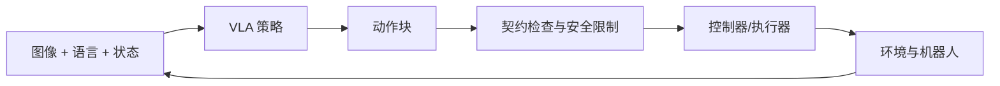
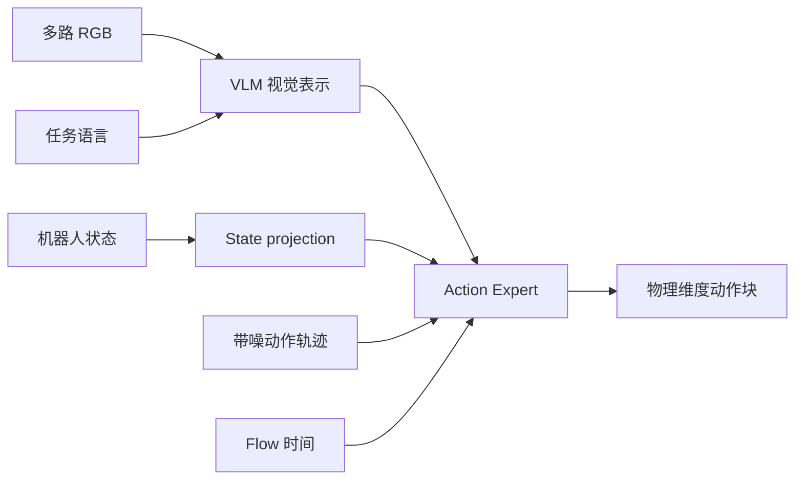

# 6.1 VLA 原理与统一契约

::: info 本章定位
本章只回答“为什么”。先建立模仿学习、SmolVLA、动作块、时间对齐和闭环安全的共同理论，
再解释仿真与真机为什么可以采用相同学习范式，却必须使用不同的数据契约。
:::

## 6.1.1 从示范到闭环策略

### 6.1.1.1 行为克隆与 VLA

模仿学习把专家示范表示为一组时序样本：

$$
\mathcal{D}=\{(o_t,a_t)\}_{t=1}^{N},
$$

其中观测 $o_t$ 包含视觉、语言和机器人状态，动作 $a_t$ 是专家在同一时刻希望执行的控制
目标。行为克隆通过最小化预测动作与专家动作之间的差异学习策略 $\pi_\theta$。

VLA（Vision-Language-Action）在普通行为克隆上增加视觉和语言条件：

$$
\pi_\theta(I_t^1,\ldots,I_t^K,s_t,\ell)\rightarrow A_t.
$$

- $I_t^k$：第 $k$ 路相机图像；
- $s_t$：机器人状态；
- $\ell$：任务或阶段语言；
- $A_t$：从当前时刻开始的一段动作序列。

VLA 替代的是“如何产生高层连续动作目标”，不是整个机器人系统。碰撞、关节限制、状态新鲜
度、急停、执行器跟踪和最终成功判定仍属于控制与安全层。



### 6.1.1.2 为什么必须闭环

训练数据来自专家分布，rollout 时模型会访问自己动作造成的新状态。一次小误差可能使下一帧
观测偏离专家轨迹，随后继续累积，这就是行为克隆常见的分布偏移。

因此项目不是把模型生成的一整段动作盲目执行到底，而是周期性重新观测、推理和替换计划：

```text
观测 → 预测动作块 → 执行一部分 → 新观测 → 重规划 → ……
```

闭环频率越高，纠偏越及时，但推理、网络和计划边界造成的抖动也越明显；频率越低，动作更
连贯，但对场景变化反应更慢。两条链路采用不同的重规划实现，理论目标相同。

## 6.1.2 SmolVLA 如何生成动作

### 6.1.2.1 多模态条件与动作专家

当前 LeRobot SmolVLA 使用本地 `SmolVLM2-500M-Video-Instruct` 作为视觉语言基座，并由动作
专家产生连续机器人动作。图像、任务语言和投影后的状态构成条件；动作专家在这些条件下对
带噪动作进行去噪式生成。



项目配置中的 `max_state_dim` 和 `max_action_dim` 是模型内部 padding 上限，不是机器人真实
自由度。仿真最终截取 26D，真机最终截取 8D。

### 6.1.2.2 Flow Matching

设专家动作块为 $A$，高斯噪声为 $\epsilon$，随机时间为 $\tau\in(0,1]$。训练构造中间状态：

$$
x_\tau=\tau\epsilon+(1-\tau)A,
$$

并让模型学习把噪声轨迹引向专家动作的速度场。推理时从噪声开始，经过若干数值积分步骤得到
动作块。课程需要把握的重点不是积分器细节，而是：模型输出具有随机性，且相邻两次预测的
重叠部分不必完全一致，所以 rollout 必须处理计划替换和连续性。

### 6.1.2.3 Action Chunk

本项目两条链路都配置 `chunk_size: 50`：

$$
A_t=[a_t,a_{t+1},\ldots,a_{t+49}].
$$

在 20 Hz policy 时间轴上，一个完整 chunk 覆盖 2.5 秒。它的价值是学习局部运动结构并摊薄
推理成本；风险是观测越旧，chunk 后半段越可能不再适合当前环境。

仿真链路默认每 30 个 policy frame 重新推理，并对新旧 chunk 的前 5 帧交叉融合；真机链路
默认每 10 个 policy step 请求新计划，使用 RTC 处理推理延迟和剩余轨迹，并按原观测时间轴
采样。不要把这两个实现写成同一种算法。

### 6.1.2.4 标准化与完整 checkpoint

不同关节的数值范围不同。LeRobot processor 使用数据集统计量标准化状态和动作：

$$
\hat{x}=\frac{x-\mu}{\sigma+\epsilon},\qquad
x=\hat{x}(\sigma+\epsilon)+\mu.
$$

因此 checkpoint 不只是 `model.safetensors`。可部署的 `pretrained_model/` 还要包含 policy
配置、preprocessor、postprocessor 和数据归一化状态。数据集和 checkpoint 的字段、顺序或
统计契约不匹配时，即使张量形状碰巧相同，也不应执行。

## 6.1.3 机器人学习中的四种量

理解下面四种量，是分析 rollout 的基础：

| 量 | 含义 | 本项目例子 |
|---|---|---|
| Observation | 策略看到的事实 | RGB、实测关节、逻辑夹爪状态 |
| Policy action | 模型原始输出 | 26D 或 8D 绝对目标动作块 |
| Command | 门控、插值、限速后实际下发的目标 | 仿真 actuator target；真机 ROS command |
| Measured state | 物理系统反馈 | 仿真关节位置；真机 `LowState` |

动作语义为 `absolute_joint_target`：每个动作表示目标关节位置，不是相对增量，也不是速度。
安全层可以减慢或拒绝动作，但不能静默改变关节顺序。

跟踪误差可写为：

$$
e_t=q_t^{command}-q_t^{measured}.
$$

如果 policy action 正常而 command 被大量限制，应检查动作动态与安全参数；如果 command 正常
但 measured state 跟不上，应检查执行器、接触或反馈；如果 policy action 本身就错误，应回到
数据、语言和 checkpoint。只看最终视频很难区分这三类问题。

## 6.1.4 时间与因果对齐

### 6.1.4.1 多频率系统

当前系统不是所有模块共用一个频率：

| 链路 | 物理/控制 | 数据与 policy |
|---|---:|---:|
| 仿真 | 120 Hz | 20 Hz，即每 6 个仿真步记录/执行一个 policy frame |
| 真机 | 30 Hz | 20 Hz，控制侧在相邻 arm target 间插值，夹爪保持阶跃 |

降低采样率不是简单丢行。每个样本必须保持“这张图、这个状态、这个动作在时间上对应什么”的
语义，否则模型会学习到提前或滞后的控制关系。

### 6.1.4.2 因果相机对齐

真机相机线程和 30 Hz 控制线程异步运行。转换采用 `latest_before`：对一个控制时间戳，只选择
不晚于它的最新相机帧，并检查最大相机年龄和跨相机偏差。这样不会把未来画面泄漏给当前动作。

仿真由同一进程驱动物理和传感器，时间关系更可控，但仍要严格保持 `record_every_n=6`，才能
满足 120 Hz 到 20 Hz 的数据契约。

### 6.1.4.3 推理延迟

真机观测通过 LAN 发送到 GPU server，响应到达时原观测已经变旧。真机 ActionBuffer 因此以
`observation timestamp` 而不是 `response arrival time` 作为 chunk 零点，跳过已经过去的动作。
过旧响应、chunk 或反馈会触发 hold、重新规划或 abort，不能无限重复最后一段轨迹。

## 6.1.5 两条链路的契约

### 6.1.5.1 仿真契约

仿真任务由 `configs/tasks/drawer_insert_close.dataset.json` 定义：

- schema：`s4_bimanual_v1`；
- state/action：左臂 7 + 左手 6 + 右臂 7 + 右手 6，共 26D；
- 图像：`chest_front_rgb`、`left_wrist_rgb`、`right_wrist_rgb`；
- 图像大小：480×680 RGB；
- action：26D 绝对关节目标；
- 数据 20 Hz，控制 120 Hz。

脚本专家内部有 27 个细控制阶段，数据语言契约将它们归并为 12 个宏阶段。控制阶段用于稳定
完成接触任务，语言阶段用于给模型提供稳定语义；两者不是一一对应。

### 6.1.5.2 真机契约

真机策略由 `real_vla_stack/config/tasks/drawer_right.yaml` 定义：

- raw schema：`s4_real_vla_v2`；policy contract：`s4_real_policy_v1`；
- state：实测右臂 7D + 逻辑夹爪 1D；
- action：右臂绝对目标 7D + 逻辑夹爪 1D；
- 图像：`observation.images.head`、`observation.images.wrist_right`；
- 数据/policy 20 Hz，机器人控制 30 Hz；
- 对齐：`latest_before`，相机年龄最多 100 ms，跨相机 skew 最多 60 ms。

逻辑夹爪不是实测手指角度。采集时 trigger 经阈值映射为 0/1，执行时再由 gripper adapter
展开为真机 6D `HandsCmd`。这个语义必须随数据和 checkpoint 一起保存。

### 6.1.5.3 为什么不能合并 checkpoint

| 维度 | 仿真 | 真机 |
|---|---|---|
| 机器人动作空间 | 双臂双手 26D | 右臂+逻辑夹爪 8D |
| 视觉 | 三相机 | 两相机 |
| 任务语言 | 放物入抽屉并关门 | 拉开、推回、松手撤离 |
| 控制动态 | PhysX actuator | 实体执行器、ROS/SDK、接触延迟 |

它们可以共享 VLM 基座和训练方法，不能共享最终 policy contract。项目使用
`meta/s4_contract.json` 的 SHA256，把数据集、checkpoint、server 和 robot request 绑定在同一
契约上；真机链路还固定 LeRobot commit 和协议版本。

## 6.1.6 仿真、真机与 Sim-to-Real

本项目目前是两条独立的数据闭环，不是把仿真 26D checkpoint 直接部署到真机。真机训练仍在
GPU `policy` 环境执行，但训练输入是已转换的真机数据；“训练运行在服务器上”不等于“使用
仿真数据训练”。

仿真可以低成本产生大量带精确状态和成功标签的数据，真机能够反映真实相机、摩擦、时延和
执行器动态。未来若做联合训练或迁移，至少要先解决动作空间统一、相机语义统一、任务语言、
归一化统计和真实动态差异，不能简单拼接两个数据目录。

## 6.1.7 安全与可复现理论

### 6.1.7.1 模型不是安全控制器

真机执行采用纵深防御：有限值和形状检查、目标跳变、速度/加速度、跟踪误差、响应新鲜度、
相机/反馈健康、publisher 冲突、SDK 身份、shadow 与人工急停门禁。任何一层失败都应阻止或
释放输出，而不是靠模型“自己学会安全”。

### 6.1.7.2 可复现对象必须分层

可复现不等于把整台电脑复制成一个大镜像。本项目固定四类身份：

- Git commit/tag：代码、配置、教程；
- OCI digest：sim、policy、robot 用户态环境；
- ModelScope revision + SHA256：模型、数据、checkpoint、项目资产；
- NVIDIA lock + 宿主 preflight：官方资产、driver 和硬件条件。

驱动属于宿主内核边界，不能可靠地 bake 到镜像。容器固定用户态依赖，NVIDIA Container
Toolkit 在运行时注入设备和驱动实现。

## 6.1.8 本章小结

SmolVLA 用图像、语言和状态生成动作块，Action Chunk 降低推理频率但引入计划过时和边界连续
性问题。可靠系统必须区分观测、模型动作、下发命令和实测状态，并处理多频率、因果对齐、
推理延迟和安全门控。仿真与真机共享学习原理，但分别受 26D/三相机和 8D/两相机契约约束；
契约一致性是进入下一章两条端到端链路的前提。
