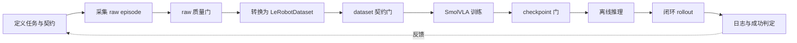
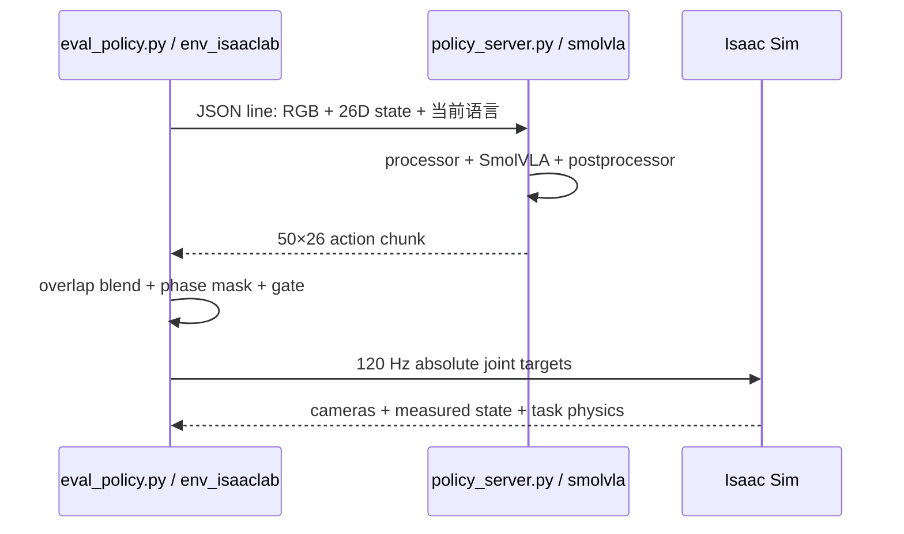
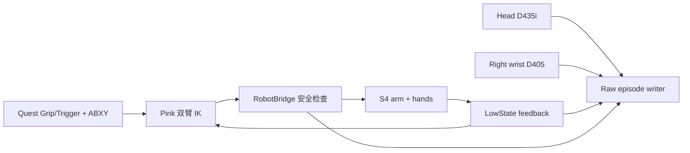
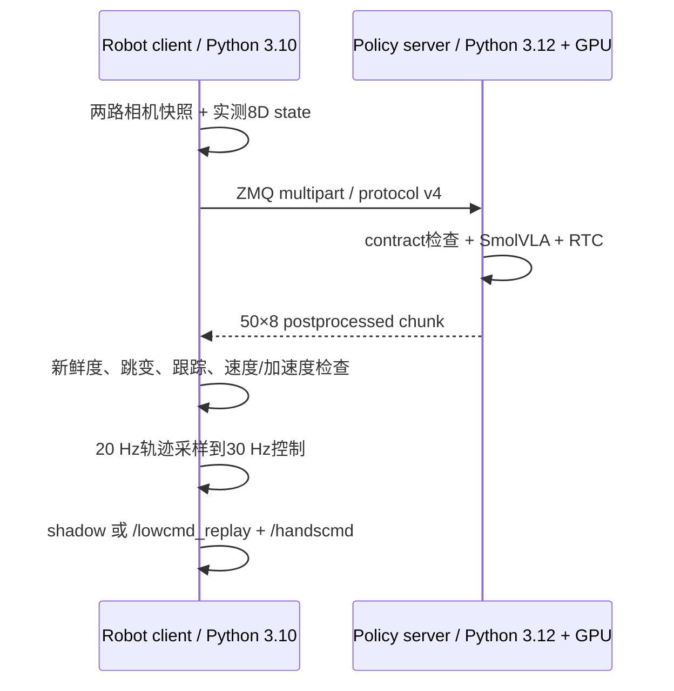

# 6.2 仿真与真机端到端链路

::: info 本章定位
本章回答“系统怎样流动”。先给出共同生命周期，再分别沿仿真和真机链路走完采集、校验、
转换、训练、checkpoint、rollout 和诊断。具体类与函数放在 6.3。
:::

## 6.2.1 两条链路的共同生命周期

两条链路都遵循同一套数据工程顺序：



顺序不能随意交换：坏数据不应靠训练修复，能加载的 checkpoint 不等于闭环可用，环境启动
成功也不等于策略完成任务。

| 阶段 | 必须回答的问题 |
|---|---|
| 任务契约 | 相机、状态、动作、语言、频率和动作语义是什么 |
| raw 采集 | observation 与 action 是否同一因果时间轴，失败 episode 是否隔离 |
| 转换 | 字段顺序、视频、episode 边界和 provenance 是否保留 |
| 训练 | dataset、base policy、processor 和输出目录是否明确 |
| checkpoint | 权重、config、processor、统计量和 contract 是否完整 |
| rollout | 新鲜度、重规划、跟踪、安全和成功条件是否可观测 |

## 6.2.2 仿真链路

### 6.2.2.1 任务与专家

当前案例 `drawer_insert_close` 在 Isaac Sim 5.1 中加载仓库、抽屉、任务物体和 S4 双臂模型。
脚本专家读取仿真真值，通过 anchor、Pink 双臂 IK、灵巧手目标和物理门控完成：

```text
双手张开 → 左手抓把手 → 拉开抽屉 → 右手抓罐子 → 放入抽屉
→ 右手撤离 → 左手关闭抽屉 → 双臂回 Home
```

专家有 27 个控制阶段，语言契约把相邻控制动作合并为 12 个宏阶段。这样既保留接触操作所需
的细粒度状态机，又避免模型语言在每个微动作处频繁切换。真实阶段、门控和映射只以
`configs/tasks/drawer_insert_close.scripted.yaml` 为准。

每次尝试可随机化主物体位置和干扰物。专家失败、超时或物理门控不通过时，失败原因写入日志，
该尝试不提交为成功示范。随机格覆盖和重试策略防止只留下“容易位置”的数据。

### 6.2.2.2 仿真 raw 数据

`record_dataset.py` 以 120 Hz 驽物理，每 6 个仿真步记录一帧，得到 20 Hz HDF5。每帧包含：

- 三路同步 RGB；
- 26D `observation.state`；
- 26D 已处理绝对关节目标 `action`；
- 控制阶段、语言阶段和任务描述；
- episode、随机化、场景和失败诊断 metadata。

这里 action 是专家希望执行的目标，state 是物理系统反馈，二者不能互换。HDF5 作为采集暂存
格式，便于事务式写入和断点续采；它不是最终训练接口。

### 6.2.2.3 仿真 raw 质量门

采集后首先检查：

1. episode 是否完整且只包含成功提交；
2. state/action 是否都是有限 26D，顺序一致；
3. 三路图像的帧数、尺寸和 RGB 语义是否一致；
4. 实际采样是否满足 20 Hz；
5. 12 个语言阶段是否按契约出现；
6. 随机化网格、失败次数和跳过格是否符合本次采集声明。

受保护的 `collect-convert` 命令依次执行采集、HDF5 检查、转换和 LeRobotDataset 检查，任何一
步失败都不会继续训练。

### 6.2.2.4 转换为 LeRobotDataset

转换器读取一个或多个 HDF5，把样本写成 LeRobot 的 Parquet、MP4 和 meta：

| HDF5 语义 | LeRobot 字段 |
|---|---|
| active/full joint state | `observation.state` |
| processed absolute target | `action` |
| `obs/chest_front_rgb` | `observation.images.chest_front_rgb` |
| `obs/left_wrist_rgb` | `observation.images.left_wrist_rgb` |
| `obs/right_wrist_rgb` | `observation.images.right_wrist_rgb` |
| 语言宏阶段 | frame 的 `task` / task index |

转换产物写入 `meta/s4_contract.json`，记录 schema、相机、场景、随机化、语言和动作契约。转换
不会自动把不兼容的多次采集合并；scene contract 不同会直接拒绝。

### 6.2.2.5 仿真训练

训练读取 20 Hz、三相机、26D LeRobotDataset，加载本地完整 `lerobot/smolvla_base` 和
`SmolVLM2-500M-Video-Instruct`。当前任务配置：

- 500,000 steps，batch size 16，seed 42；
- `chunk_size=50`，`n_obs_steps=1`；
- `max_state_dim=50`，`max_action_dim=32`；
- 冻结 vision encoder，只训练 action expert，并训练 state projection；
- 每 50,000 steps 保存一次。

正式发布选择 350K 的 `pretrained_model/`。公开部署不包含 `training_state/`；如果需要续训，
optimizer、scheduler、RNG 和 step 必须作为单独的私有恢复制品保存。

### 6.2.2.6 仿真 rollout

仿真 rollout 在一个 sim 容器中同时使用两个隔离 Conda 环境：



`policy_server.py` 是本机子进程，通过 stdin/stdout JSON lines 通信，不是 LAN ZMQ server。
`eval_policy.py` 从 dataset 恢复 12 阶段常见顺序和中位持续时间，默认每 30 个 20 Hz frame
重新推理，新旧 chunk 交叉融合 5 帧，阶段切换融合 5 帧；只有当前阶段允许的 action group 能
改变，其他关节保持阶段入口命令。

完整 episode 中：

- `complete` 表示计划时间轴和程序流程走完；
- `success` 表示最终物体满足任务空间判定；
- 二者可以不同。

发布验收中的完整环境 episode 为 `complete=true`、`success=false`。在后续干净 clone 复验中，
同一 checkpoint 也出现过抽屉 gate timeout，结果为 `complete=false`、`success=false`，但评估器
正常返回并保存 summary。GPU 物理仿真和策略结果不能由进程退出码替代：`verify sim` 与断网
smoke 判断环境是否可运行，`complete` 判断计划是否走完，`success` 判断任务是否完成。

### 6.2.2.7 仿真操作顺序

复现已发布的 350K rollout：

```bash
./s4 preflight
./s4 build artifacts
./s4 setup sim_rollout
./s4 setup-isaac-assets
./s4 setup-kit-extensions --accept-nvidia-license
./s4 pull sim
./s4 verify sim
./s4 rollout sim-smoke-offline
./s4 rollout sim-offline
```

本地桌面需要观察场景时运行：

```bash
./s4 rollout sim-gui
```

`sim-gui` 使用与 headless 相同的镜像、资产、checkpoint 和输出目录，不传 `--headless`，并
把 Vulkan ICD 从 headless EGL 切换为 NVIDIA GLX。入口通过私有 X11 cookie 授权容器访问宿主
窗口，不需要执行不安全的 `xhost +`。宿主必须具有
本地 X11/XWayland 会话、已设置的 `DISPLAY` 和 `xauth`；远程无桌面服务器继续使用 headless。

复现已发布数据的一步训练：

```bash
./s4 setup sim_training
./s4 pull policy
./s4 verify policy
./s4 train policy-smoke
```

创建新仿真数据时不能写只读 `/artifacts/datasets`，应把 `S4_DATA_ROOT` 指向输出挂载：

```bash
./s4 compose --profile sim run --rm --no-deps \
  -e S4_DATA_ROOT=/workspace/outputs/datasets \
  sim bash run.sh collect-convert --episodes 20 --headless
```

新数据最终位于宿主 `.s4/outputs/datasets/`。先用小批量验证专家成功率和契约，再扩大采集。

## 6.2.3 真机链路

### 6.2.3.1 真机采集拓扑

真机 raw 采集不启动 Isaac Sim，也不导入 Torch。机器人电脑运行 Python 3.10、ROS 2 Humble、
Pink/QP、Quest 输入和 RealSense：



READY 阶段允许调整双臂；按 A 并重新确认 Home 后进入记录，策略任务只保留配置中的右臂和右
手。Trigger 被映射为逻辑 gripper 0/1，再展开成真机 6D HandsCmd。B 结束人工遥操后仍继续
记录自动回 Home；X 保存，Y 长按丢弃。

### 6.2.3.2 真机 raw episode

每个 episode 包含：

- `trajectory.h5`，或依赖不可用时的 `trajectory.npz`；
- 每路相机独立 MKV；
- 采集配置快照、Git commit、dirty 标志和采集代码 SHA256；
- 30 Hz 实测右臂状态、逻辑夹爪、已发布绝对目标、时间戳和质量信息；
- `collection_phase`：`0=teleop`、`1=return_home`。

采集任务文本包含 return Home，但真机训练 contract 当前 `include_phases: [teleop]`，因此转换
只训练人工任务段；policy instruction 不承诺自动回 Home。rollout 的开始/结束 Home 由确定性
控制逻辑负责，不交给模型学习。

### 6.2.3.3 真机采集质量门

episode 只有在状态、动作、相机和写盘均有效时才能保存。主要检查：

- 相机空帧、帧数差异、年龄和跨相机 skew；
- robot state 是否超过 100 ms 未更新；
- 动作/state 是否有限、控制 fault 或低维丢样；
- 视频能否解码、episode 是否完成；
- 磁盘低水位和异常退出留下的 pending episode。

`WARN` 可以保留供人工查看；`INVALID`、`ERROR` 和 `PENDING` 不能进入转换。隔离命令采用
quarantine，不直接删除原始数据。

### 6.2.3.4 因果转换

`real_vla_stack` 先验证 raw，再以 20 Hz control index 生成 LeRobotDataset。对每个动作时间戳，
两路相机采用 causal `latest_before` 映射；转换报告保存 raw episode、raw control index、相机
frame index、时间戳和 age，便于追溯到源数据。

最终字段为：

| 字段 | 当前语义 |
|---|---|
| `observation.state` | 实测右臂 7D + 逻辑 commanded gripper 1D |
| `action` | 已发布右臂绝对目标 7D + 逻辑 gripper target 1D |
| `observation.images.head` | 头部 RGB |
| `observation.images.wrist_right` | 右腕 RGB |
| `task` | 右抽屉任务 instruction |

转换写入 `s4_contract.json`、`s4_conversion_report.json` 和可逐帧追溯的
`s4_source_index.parquet`。

### 6.2.3.5 真机训练与 checkpoint

训练运行在 GPU 服务器的 policy 环境，而不是 robot 电脑，也不需要 Isaac Sim。它使用真机
LeRobotDataset 和同一个 SmolVLA base，输出 8D policy。配置提供：

- smoke 300 steps；overfit 5,000；baseline 200,000；full 400,000；
- batch size 16、16 workers、50-step chunk；
- 每 50,000 steps 保存；
- 正式发布选择 300K `pretrained_model/`。

训练前 preflight 通过 LeRobot 公共 API 严格加载完整 base policy，检查 action expert、state/
action projection、processor 和 tensor 键；checkpoint-check 再检查数据 contract、provenance 和
一次推理。

### 6.2.3.6 真机分布式 rollout

真机 rollout 明确分成两台机器：



server 保存 raw model-space chunk 作为下一次 RTC guidance；robot 只接收物理空间动作，不能把
限速后的 command 当作 RTC history。机器人以 observation time 采样 action，过时响应会被拒绝。

默认 robot YAML 是 `rollout.mode: live`，但代码仍要求 CLI 同时显式传入 `--live` 才创建命令
publisher。不带 `--live` 是 shadow。`--live --preflight-only` 会完成真实相机、反馈、网络和
一次推理检查，但在 Home 或 policy motion 前退出。

### 6.2.3.7 真机操作顺序

准备发布制品并验证 server：

```bash
./s4 build artifacts
./s4 setup real_full
./s4 pull policy
./s4 pull robot
./s4 verify real-policy
./s4 verify real-server
./s4 verify robot
```

GPU 服务器启动正式 300K server：

```bash
docker compose --profile real up policy-server
```

机器人端首先只做 shadow：

```bash
./s4 compose --profile real run --rm robot \
  bash real_vla_stack/run.sh rollout --max-runtime-s 30
```

事件、状态和 shadow 图像保存在机器人宿主
`.s4/outputs/real_rollouts/rollout_*/`，不会留在一次性容器文件系统中。

连接硬件后的 live 不属于 v0.1.0 已验收范围。必须先检查相机、feedback、协议、日志、急停、
关节方向、限位、工作区和 publisher 唯一性，再依次执行 preflight-only、5 秒、10 秒和完整
episode。不能从无硬件 `verify robot` 直接跳到 live。

### 6.2.3.8 创建新真机数据

先在没有动作输出的条件下确认相机和环境，再按现场流程启用采集。真实动作命令具有风险，下面
的 `--arm-output` 只能由现场操作员在安全门通过后加入：

```bash
# 只读检查
./s4 verify robot

# 进入 robot 容器查看采集帮助，不产生动作
./s4 compose --profile real run --rm robot bash run.sh real-collect --help
```

raw 默认写到 `/workspace/outputs/raw`，宿主为 `.s4/outputs/raw`。转换新数据时覆盖可写数据根：

```bash
./s4 compose --profile train run --rm --no-deps \
  -e S4_DATA_ROOT=/workspace/outputs/datasets \
  policy bash real_vla_stack/run.sh raw-check

./s4 compose --profile train run --rm --no-deps \
  -e S4_DATA_ROOT=/workspace/outputs/datasets \
  policy bash real_vla_stack/run.sh convert
```

转换和训练前始终先运行 `dataset-check`。`--overwrite` 会替换目标数据集，不应在未备份时使用。

## 6.2.4 两条链路的诊断闭环

| 现象 | 先检查 | 不应立即做的事 |
|---|---|---|
| 专家失败率高 | IK、anchor、接触、阶段门控 | 增加训练 steps |
| 视频正常但动作滞后 | 时间戳、采样率、latest-before | 随意平移数据行 |
| checkpoint 无法加载 | contract、processor、base provenance | `strict=False` 忽略 |
| 离线动作正常、在线失败 | 分布偏移、重规划、tracking | 只看训练 loss |
| 真机频繁 hold | 网络年龄、limiter、接触跟踪 | 放宽 stale/safety gate |
| command 正常、measured 异常 | 执行器、ROS feedback、接触 | 重训模型 |

每次实验至少固定并记录：代码 commit、镜像 digest、数据 contract SHA256、checkpoint、seed、
配置 diff、输出目录和成功判定。否则无法判断改进来自模型、数据、环境还是控制参数。

## 6.2.5 本章小结

仿真链路通过脚本专家生成 26D/三相机数据，在 sim/policy 环境完成转换、训练和本机闭环；真机
链路通过 Quest、ROS 和 RealSense 生成 8D/两相机数据，在 GPU host 训练，并由 LAN server 与
安全 robot client 分布式执行。二者共享“契约先于训练、质量门先于下一步”的方法，但 raw
格式、动作空间、时钟和 rollout 机制不同。下一章将这些步骤逐一映射到真实文件和代码模块。
