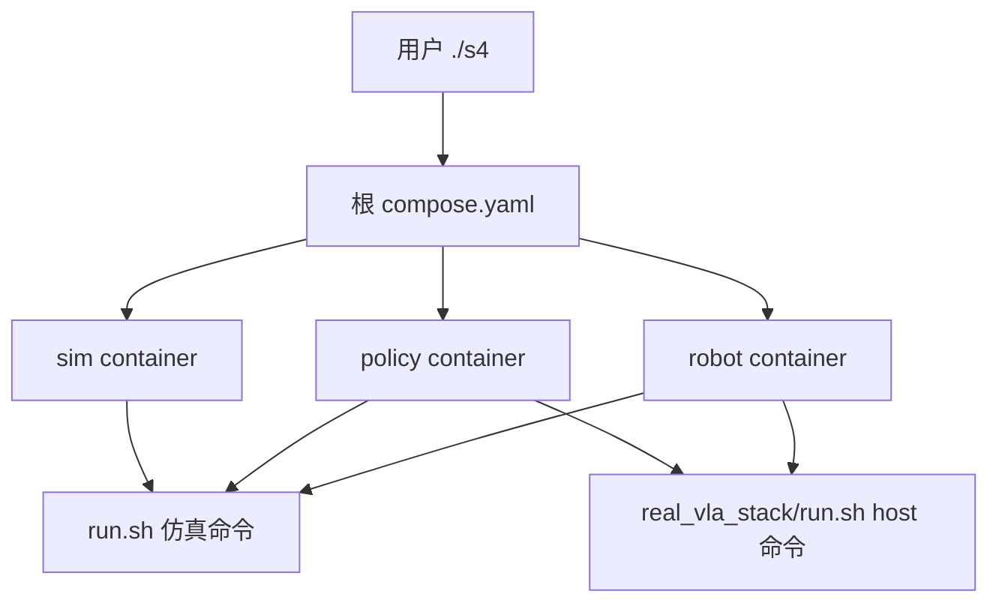

# 6.3 两条链路的代码实现

::: info 本章定位
本章回答“代码在哪里、怎样连接”。内容按入口、配置、仿真、真机采集、真机 rollout、容器和
扩展方法组织。命令从仓库根目录执行，文件路径相对仓库根目录。
:::

## 6.3.1 入口分层

项目有三层入口，各自服务不同读者：

| 层 | 文件 | 职责 |
|---|---|---|
| 发布入口 | `./s4` | 拉镜像、下载制品、主机预检、标准验证和 smoke |
| 业务入口 | `s4_smolvla_isaaclab/run.sh` | 仿真采集、转换、训练、仿真 rollout、遥操和真机采集 |
| 真机策略入口 | `s4_smolvla_isaaclab/real_vla_stack/run.sh` | 真机 raw 检查、转换、训练、server 和 robot rollout |

普通复现者优先使用 `./s4`。开发者进入对应容器后使用业务入口。旧单体 Dockerfile、旧 Compose
和旧 Docker runner 已删除，不是备用方案。



查看真实命令集：

```bash
./s4 help
./s4 shell sim
# 容器内：bash run.sh help
```

## 6.3.2 配置如何生效

### 6.3.2.1 仿真配置

`configs/active_task.default` 给出默认任务，`.local/active_task` 可在本机覆盖。任务使用三类配置：

| 配置 | 内容 |
|---|---|
| `drawer_insert_close.dataset.json` | 路径、schema、相机、26D 字段、20/120 Hz |
| `drawer_insert_close.scripted.yaml` | 场景、专家阶段、IK、随机化、语言阶段和门控 |
| `drawer_insert_close.smolvla.yaml` | 训练、VLM、chunk、优化器和输出目录 |

`s4_pipeline/paths.py` 解析项目路径和 active task；`s4_pipeline/config.py` 加载 dataset/training
配置并展开环境变量；`tasks/loading.py` 根据任务模块字符串加载 scene/controller。新增任务时
不要在入口脚本里堆条件分支，应注册任务配置和模块。

### 6.3.2.2 真机配置

真机配置分为采集和部署两组：

- `real_vla/config/collection.yaml`：ABXY、质量阈值、raw 存储和采集 task；
- `real_vla/config/robot.yaml`：活动臂、30 Hz、8D 动作；
- `real_vla/config/cameras.example.yaml`：公开相机模板；实际 `cameras.yaml` 被 Git 忽略；
- `hardware_teleop/config/quest_hardware.yaml`：ROS topic、Pink、Home、手和安全参数；
- `real_vla_stack/config/pipeline.yaml`：组合 task/host/robot 三个 profile；
- `real_vla_stack/config/tasks/drawer_right.yaml`：不可歧义的 policy contract；
- `real_vla_stack/config/hosts/train_host.yaml`：数据、训练、server、checkpoint；
- `real_vla_stack/config/robots/s4_real.yaml`：网络、重规划、freshness 和 rollout safety。

主机地址、DDS 网卡、ROS domain 和相机序列号通过根 `.env` 传入，不能提交真实现场值。配置
加载器对缺失变量、维度、相机数量、动作语义和阈值关系 fail closed。

## 6.3.3 仿真链路实现

### 6.3.3.1 场景与机器人

| 文件 | 责任 |
|---|---|
| `tasks/drawer_insert_close_scene.py` | 仓库、抽屉、物体、灯光、相机和机器人实例 |
| `s4_robot/simulation.py` | 从 URDF 生成 IsaacLab articulation |
| `s4_robot/s4_robot_cfg.py` | 关节名、初始状态、actuator 和机器人配置 |
| `s4_robot/control_mapping.py` | 26D action slice 和关节顺序 |
| `s4_robot/pink_bimanual_ik.py` | 双臂 Pink IK |
| `s4_robot/arm_control.py` | 目标、平滑和关节控制辅助 |

项目机器人和任务物体来自 ModelScope，只读覆盖挂载到源码的 `assets/`；NVIDIA warehouse、
drawer 和纹理由官方资产 lock 准备到本地 `.s4/isaac-assets/5.1`。代码只引用容器路径，不
记录维护者 home 路径。

### 6.3.3.2 专家控制器

`tasks/drawer_insert_close_controller.py` 实现专家状态机，
`tasks/drawer_insert_close.py` 描述任务级状态与成功条件，参数来自 scripted YAML。

状态机的实现原则是：

1. 目标尽量由当前 object/handle anchor 加相对 offset 产生；
2. 靠近、停稳、闭手、保持、抬升分开；
3. 进入下一阶段同时检查 TCP/关节和真实物理状态；
4. 失败返回结构化原因，由采集器决定重试，不把失败 episode 写成示范；
5. 27 个控制阶段通过 `s4_pipeline/language_phases.py` 映射为稳定的 12 个语言 ID。

随机化、分层格和失败重试分别位于：

- `s4_pipeline/randomization.py`；
- `s4_pipeline/retry_policy.py`；
- `s4_pipeline/failure_reporting.py`；
- `s4_pipeline/drawer_distractors.py`。

### 6.3.3.3 采集与转换

`scripts/record_dataset.py` 是 IsaacLab 应用入口，负责解析 AppLauncher 参数、创建场景、运行
专家、按 stride 采样并提交 episode。数据层拆为：

- `data/hdf5_schema.py`：HDF5 名称与 schema；
- `data/dataset_writer.py`：episode 写入；
- `scripts/dataset_check.py`：HDF5/LeRobotDataset/checkpoint 检查；
- `scripts/convert_lerobot.py`：命令行适配；
- `data/lerobot_conversion.py`：实际 LeRobotDataset 创建和发布。

一体化脚本 `scripts/collect_convert.sh` 的内部顺序固定为：record → HDF5 check → convert →
LeRobot check。`collect_convert_check_train.sh` 和 `convert_check_train.sh` 在此基础上增加训练门，
不会跳过检查直接训练。

### 6.3.3.4 训练实现

`scripts/train_smolvla_local.sh` 把 task YAML 转换为固定 LeRobot CLI 参数，处理 fresh/resume、
单卡/DDP、输出目录保护和 checkpoint 保存。`scripts/training_runtime_preflight.py` 在启动前验证
数据、base policy 和 CUDA；`scripts/verify_accelerate_launch.py` 检查 DDP 参数传播。

正式训练仍调用固定 LeRobot submodule 提供的 `lerobot-train`，项目不复制其模型实现。修改
LeRobot 或 base policy 后，必须同步更新 submodule commit、环境镜像和 release manifest。

### 6.3.3.5 仿真 rollout 实现

`scripts/eval_policy.py` 运行 Isaac、采集三相机和状态、管理 phase、chunk、mask、gate、视频、
CSV 和 summary；`scripts/policy_server.py` 在 smolvla 环境加载模型并通过 JSON lines 提供推理。

关键纯逻辑位于：

- `s4_pipeline/rollout_control.py`：26D phase action mask 和 hard failure；
- `s4_pipeline/rollout_metrics.py`：任务状态与统计；
- `scripts/diagnose_rollout.py`：动作 CSV 汇总；
- `scripts/compare_rollout_logs.py`：实验日志比较。

一次 policy frame 的处理顺序是：读取 measured state/RGB → 请求 chunk → overlap ensemble →
phase transition blend → phase action mask → actuator command → 物理反馈与 gate。日志应分别保存
raw、融合、mask、command 和 actual，避免把不同处理阶段混为“模型动作”。

## 6.3.4 真机采集实现

### 6.3.4.1 复用硬件控制层

`real_vla` 不复制 ROS bridge 或 IK。`real_vla/scripts/collect.py` 创建 `CollectionHooks`，把采集
状态机挂到 `hardware_teleop/pink_main.py` 的每个控制 tick：

- `begin_tick` 决定当前是否允许遥操、启用哪只手臂、是否执行 Home；
- `end_tick` 接收 measured action、最终 command 和状态，决定记录或状态转移；
- `on_status` 更新 dashboard 和故障状态。

硬件层主要模块：

| 文件 | 责任 |
|---|---|
| `hardware_teleop/ik/pink_backend.py` | Pink QP IK |
| `hardware_teleop/ros/robot_bridge.py` | ROS feedback 与 `/lowcmd_replay`、`/handscmd` |
| `hardware_teleop/safety.py` | 输入/状态/关节保护 |
| `hardware_teleop/joint_mapping.py` | ROS motor 与 policy 关节映射 |
| `hardware_teleop/hand_mapping.py` | 灵巧手命令映射 |
| `hardware_teleop/startup.py` | 启动检查与 Home |

只有显式 `--arm-output` 才允许采集程序发布真机动作。是否带腿部 deploy 是另一条经过检查的
路由，不能与默认 replay route 混用。

### 6.3.4.2 Episode 状态与写入

`real_vla/collection/state_machine.py` 实现 HOMING、READY、RECORDING、RETURNING_HOME、REVIEW
等状态和 ABXY 事件；`home_manager.py` 生成确定性 Home；`gripper_adapter.py` 在逻辑 1D 和
手部 6D 间转换。

数据模块：

- `cameras/camera_manager.py`：管理多个 RealSense reader；
- `cameras/frame_buffer.py`：相机线程最新帧；
- `collection/recorder.py`：转发 8D state/action；
- `collection/episode_writer.py`：异步低维和视频写入、pending 恢复；
- `collection/quality.py`：在线质量结果；
- `collection/sync.py`：采集同步统计；
- `collection/schema.py`：`PolicyState`、`PublishedCommand` 和 episode meta。

`real_vla/scripts/audit_dataset.py` 默认只读审计；带 quarantine 参数只移动无效数据到隔离区，
不直接删除。这一边界适合教学和现场恢复。

## 6.3.5 真机 host 数据与训练实现

`real_vla_stack/common/` 不导入 Torch 或 ROS，负责配置、contract、hash、protocol 和公共错误。
这种 import boundary 由测试保护。

host 数据模块：

| 文件 | 责任 |
|---|---|
| `host/dataset/raw_reader.py` | 读取 raw episode |
| `host/dataset/raw_validator.py` | raw schema、phase 和质量门 |
| `host/dataset/causal_resampler.py` | latest-before 因果映射 |
| `host/dataset/video_decoder.py` | 按映射解码 RGB |
| `host/dataset/exporter.py` | 创建 8D/两相机 LeRobotDataset |
| `host/dataset/lerobot_validator.py` | dataset 与 contract 验证 |
| `host/dataset/analyze_action_dynamics.py` | 从示范估计动作动态 |

`exporter.py` 使用临时 staging 目录；全部 episode finalize、contract 和 source index 写完后才
原子发布目标目录。转换中断不会留下看似完整的数据集。

训练模块：

- `host/training/preflight.py`：严格加载完整 SmolVLA base；
- `host/training/launcher.py`：把 profile 和 contract 转为训练命令；
- `host/training/checkpoint.py`：验证部署 checkpoint 并写/读 provenance；
- `host/training/behavior_probe.py`：多样本行为检查。

真机训练运行在 policy 容器，robot 容器不安装 Torch/LeRobot。这个边界减少机器人端环境冲突，
也确保只有 robot 进程能接触 ROS command publisher。

## 6.3.6 真机 server 与 robot client

### 6.3.6.1 Host server

`host/inference/policy_runner.py` 负责 processor、SmolVLA、postprocessor 和 RTC raw history；
`host/inference/server.py` 负责 ZeroMQ request/response、session 和 contract 检查。CUDA 配置失败
时不回退 CPU。

### 6.3.6.2 Wire protocol

`common/protocol.py` 当前为 protocol v4。Observation multipart 包含：metadata、float32[8]
state、head JPEG、wrist JPEG；Action response 包含 metadata 和 float32[N,8] chunk。

metadata 绑定：

- contract SHA256；
- session/request ID；
- observation 和两相机时间戳；
- task、checkpoint 和 policy FPS；
- RTC delay、已接受 request、history reset 和 execution lag。

任何版本、session、顺序、shape、有限值或 contract 错误都在动作进入 buffer 前失败。

### 6.3.6.3 Robot rollout

`real_vla_stack/robot/rollout/main.py` 是生命周期编排器，依赖：

| 模块 | 责任 |
|---|---|
| `observation.py` | 原子复制两路最新帧、age/skew、BGR→RGB、JPEG |
| `policy_client.py` | 单独网络 worker 和 ZeroMQ socket |
| `action_buffer.py` | observation-time 20 Hz 轨迹采样，arm 插值、gripper 阶跃 |
| `command_filter.py` | 7 关节速度和加速度限制 |
| `execution_sync.py` | limiter/接触落后时 hold、resync、RTC reset |
| `safety.py` | chunk 跳变、tracking 和阈值检查 |
| `logger.py` | 后台事件、图像和 summary 写入 |

控制循环保持 30 Hz。网络 worker 不阻塞控制线程；响应过旧时保持最后安全目标并请求新计划，
超过恢复期限则 abort。故障默认不自动回 Home，因为故障路径中的额外运动可能造成第二次碰撞。

Live 是双钥匙设计：robot YAML 中 `mode: live` 和 CLI `--live` 必须同时满足。不带 `--live` 时
不创建命令 publisher；`--preflight-only` 在真实推理后、任何 Home/policy motion 前退出。

## 6.3.7 Docker 与数据实现

### 6.3.7.1 三个运行环境

| 镜像 | Dockerfile | Python/核心依赖 |
|---|---|---|
| sim | `docker/sim/Dockerfile` | Python 3.11 Isaac 环境 + Python 3.12 SmolVLA 环境 |
| policy | `docker/policy/Dockerfile` | Python 3.12、PyTorch、固定 LeRobot |
| robot | `docker/robot/Dockerfile` | Ubuntu 22.04、Python 3.10、ROS 2 Humble、qi、Pink/QP |

另有小型 `artifacts` 工具镜像，只负责 ModelScope 下载和 SHA256。正式环境镜像不含项目代码、
数据、模型、项目/NVIDIA 资产、输出或宿主 driver。

### 6.3.7.2 Compose 挂载

根 `compose.yaml` 统一容器路径：

| 宿主 | 容器 | 权限/用途 |
|---|---|---|
| 仓库根 | `/workspace/smolVLA` | 只读源码 |
| `.s4/artifacts` | `/artifacts` | 只读发布制品 |
| `.s4/outputs` | `/workspace/outputs` | 可写实验、采集、训练 |
| `.s4/cache` | `/workspace/cache` | 可写 Kit/XDG/Hub cache |
| `.s4/isaac-assets` | `/workspace/isaac-assets` | NVIDIA 官方资产，sim 只读 |
| `/dev/bus/usb` | 同路径 | robot RealSense |

因此已有发布数据使用 `S4_DATA_ROOT=/artifacts/datasets`；创建新数据时必须显式改为
`/workspace/outputs/datasets`。不要把生成结果写回只读源码或发布制品。
真机 rollout 日志固定写入 `/workspace/outputs/real_rollouts`，退出一次性 robot 容器后仍保留在
宿主 `.s4/outputs/real_rollouts`。

### 6.3.7.3 驱动边界

Dockerfile 固定 CUDA/Isaac/PyTorch 用户态依赖。宿主 NVIDIA 内核驱动、设备节点、Vulkan
driver implementation 由 NVIDIA Container Toolkit 注入。`docker/host_preflight.sh` 在启动前
检查 OS、driver、GPU、VRAM、Toolkit、RAM 和磁盘；容器不能消除硬件支持线。

## 6.3.8 验证代码与测试边界

发布入口提供分层门：

```bash
./s4 verify sim
./s4 verify policy
./s4 verify real-policy
./s4 verify real-server
./s4 verify robot
```

- `docker/verify_runtime.sh`：CUDA、Vulkan、Isaac、资产、camera 和仿真 checkpoint；
- `docker/policy/verify_runtime.sh`：训练环境、数据、视频和 base model；
- `docker/policy/verify_real_runtime.sh`：真机数据与 300K checkpoint 离线推理；
- `scripts/verify_real_policy_server.py`：两个真实协议请求与 RTC state；
- `docker/robot/verify_runtime.sh`：ROS/qi/Pink/QP/RealSense SDK，无 publisher。

`real_vla_stack/tests/` 覆盖 contract、协议、因果采样、buffer、filter、同步、延迟、server session
和 import boundary。仓库 `scripts/ci/static_checks.sh` 覆盖语法、Compose、submodule、manifest、
大文件、绝对路径和敏感信息，但不冒充 GPU 或物理硬件测试。

## 6.3.9 扩展任务的正确顺序

新增任务或机器人时按以下顺序修改：

1. 定义新的 dataset/policy contract，不复用不匹配的旧 ID；
2. 实现场景、控制器或真机 adapter；
3. 用少量 raw episode 验证时间戳、字段和动作语义；
4. 转换并生成新的 `s4_contract.json`；
5. 训练新输出目录，保留 base 和 provenance；
6. 先做离线推理，再做仿真或 shadow；
7. 真机严格经过 preflight-only、人工门禁和短时 live；
8. 发布时更新 ModelScope revision、镜像 digest、lock 和 release manifest。

不要通过修改旧 contract 的含义来“兼容”新任务，也不要关闭严格加载、安全检查或 timestamp
检查来让实验暂时运行。

## 6.3.10 本章小结

当前实现把环境编排、仿真业务和真机策略拆成三层入口；把仿真场景/专家/数据/rollout 与真机
采集/host/robot 明确分包；再通过 contract SHA256、固定 submodule、OCI digest 和只读挂载
连接起来。理解这些边界后，读者既可以按公开入口复现，也能沿模块扩展任务，而不会重新回到
源码、数据、驱动和运行状态混在一个超大镜像中的旧方式。
