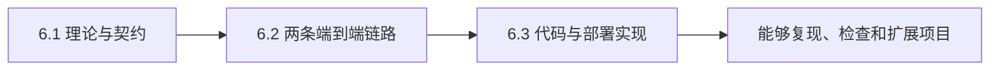

---
prev:
  text: '5.3 视觉抓取与放置'
  link: '/05-vision-control/03-visual-pick-place'
next:
  text: '6.1 VLA 原理与统一契约'
  link: '/06-smolVLA/01-principles'
---
# SmolVLA 教程：从仿真与真机数据到闭环控制

本课程以 S4 双臂机器人项目的当前代码为依据，讲清两条可以独立运行、又共享学习策略思想的
链路：Isaac Sim/IsaacLab 仿真链路，以及 Quest 遥操、ROS 2 和 RealSense 组成的真机链路。

## 课程结构

章节编号和文件名是外部课程框架的稳定接口，不随项目内部目录调整：

| 章节 | 定位 | 回答的问题 |
|---|---|---|
| [6.1 VLA 原理与统一契约](01-principles.md) | 理论 | VLA 学什么；Action Chunk、时间对齐和闭环控制为什么重要；仿真与真机如何共享契约 |
| [6.2 仿真与真机端到端链路](02-implementation.md) | 链路 | 两类数据怎样采集、转换、训练并进入 rollout；每一道质量门在哪里 |
| [6.3 两条链路的代码实现](03-deployment.md) | 实现 | 入口、配置、模块、进程、容器和数据目录怎样对应到代码 |

## 学习目标

完成三章后，读者应能够：

- 解释 SmolVLA 如何从图像、语言和机器人状态生成动作块；
- 区分 observation、policy action、安全处理后的 command 和 measured state；
- 说明仿真 26D/三相机链路与真机 8D/两相机链路为什么不能混用数据或 checkpoint；
- 沿代码找到仿真专家采集、HDF5 转换、训练和离线 rollout；
- 沿代码找到真机遥操采集、因果对齐、训练、LAN policy server 和安全 client；
- 理解 Git、GHCR、ModelScope、NVIDIA 官方资产和本机输出各自的管理边界；
- 用契约、日志和分层验收定位问题，而不是只看训练 loss 或容器是否启动。

## 当前教学案例

| 项目 | 仿真链路 | 真机链路 |
|---|---|---|
| 任务 | 打开抽屉、放入物体、关闭抽屉 | 右臂抓把手、拉开、推回、松手撤离 |
| 数据 schema | `s4_bimanual_v1` | `s4_real_vla_v2` |
| state/action | 26D / 26D | 8D / 8D |
| 相机 | 胸前、左腕、右腕 | 头部、右腕 |
| 数据/控制频率 | 20 Hz / 120 Hz | 20 Hz / 30 Hz |
| 发布 checkpoint | 350K | 300K |
| rollout | sim 容器内本地 policy 子进程 | GPU policy server + robot client |

两条链路共享 SmolVLA、LeRobotDataset、绝对关节目标和 Action Chunk，但它们的任务、维度、
相机键、语言和控制频率不同。`meta/s4_contract.json` 及其 SHA256 是数据和 checkpoint 能否配对
的依据，不能只凭文件名判断兼容。

## 证据约定

课程中的事实按以下优先级理解：

1. 当前代码与配置；
2. `release/manifest.yaml` 中固定的版本和验收记录；
3. 自动化测试定义的行为；
4. 项目历史实验记录；
5. 外部论文或官方文档。

教程命令默认从仓库根目录执行。涉及真实机器人输出的命令只用于解释实现，必须完成现场安全
门禁后才能运行。v0.1.0 已在当前 RTX 4090 工作站完成仿真、训练、真机策略协议和 robot
无硬件验证；异机复现与物理机器人动作验证尚未完成。

## 版本基线

- Isaac Sim 5.1.0.0；
- IsaacLab fork：2.3.2 兼容分支，Python package 0.54.2；
- LeRobot 0.6.1 对应的固定 submodule commit；
- sim：Python 3.11；policy：Python 3.12；robot：Python 3.10 + ROS 2 Humble；
- 正式不可变身份见仓库根目录 `release/manifest.yaml`。

扩展阅读：工程快速开始见根目录 `README.md`，简明复现步骤见
`s4_smolvla_isaaclab/docs/REPRODUCTION.md`，真机 rollout 安全细节见
`s4_smolvla_isaaclab/real_vla_stack/docs/real_robot_rollout.md`。
